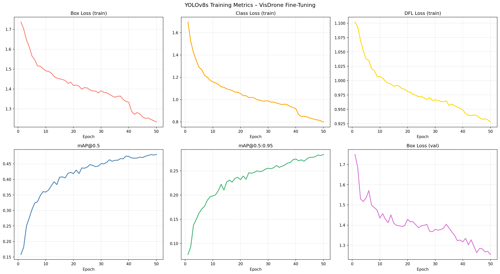
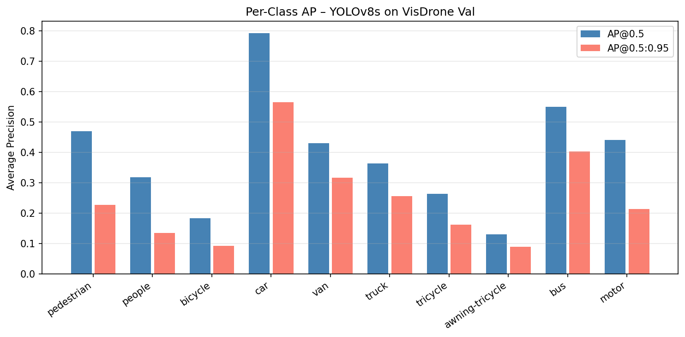
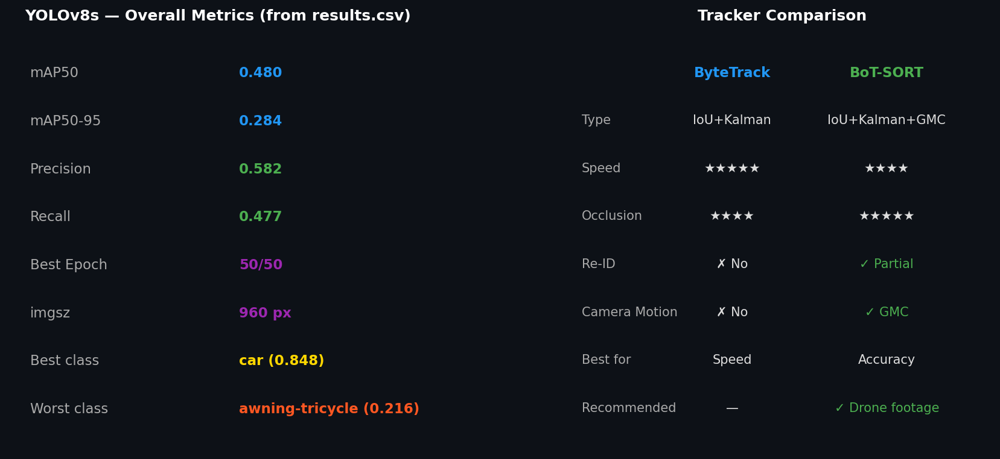
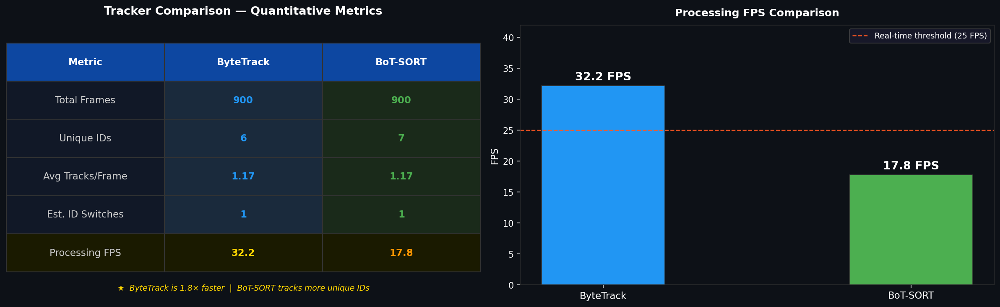
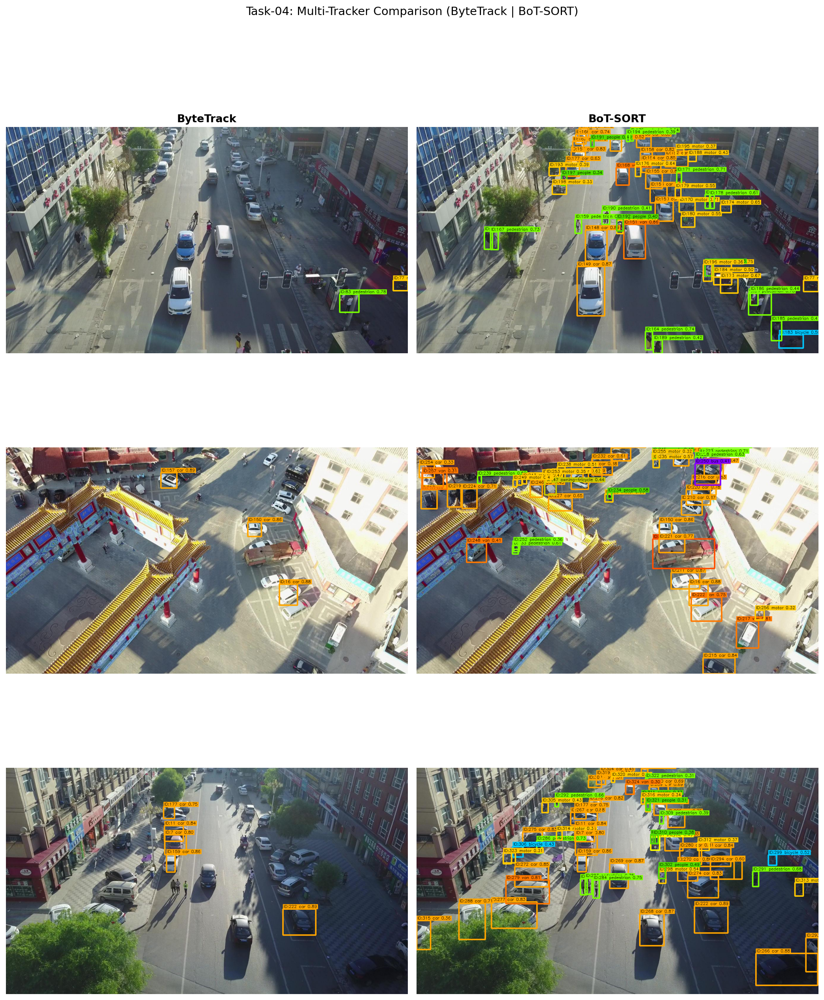
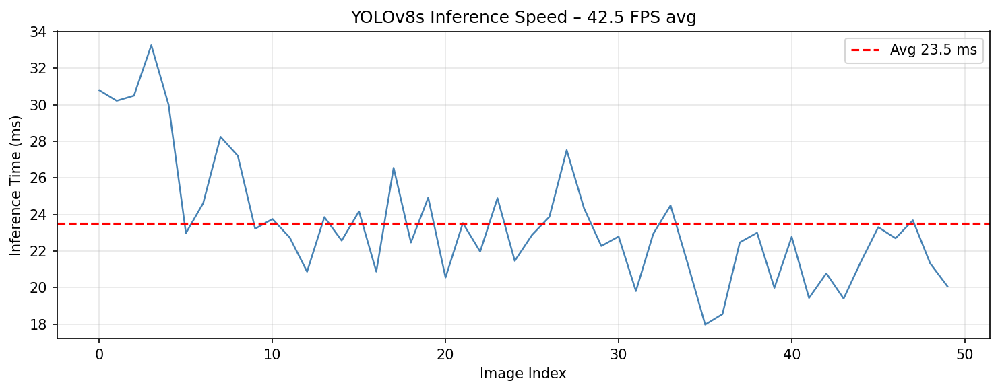

#  Drone Human Detection & Counting System

Fine-tuned YOLOv8s on the VisDrone2019-DET dataset for aerial human and vehicle detection, with multi-tracker comparison using ByteTrack and BoT-SORT.

---
Notebook Link:
-[(Drone Human Detection & Counting System)](https://www.kaggle.com/code/hasnayhasin/drone-human-detection-counting-system))

-[(Drone Human Detection & Counting System- Extended)](https://www.kaggle.com/code/hasnayhasin/drone-human-detection-counting-system-extended))


---
##  Overview

This project builds an end-to-end drone vision pipeline:

- **Dataset**: VisDrone2019-DET (10 classes, aerial imagery)
- **Model**: YOLOv8s fine-tuned for 50 epochs on dual T4 GPUs
- **Detection**: Frame-by-frame human and vehicle detection with count overlay
- **Tracking**: Multi-tracker comparison - ByteTrack vs BoT-SORT
- **Counting**: Class-aware human counting (pedestrian, people, bicycle, tricycle, motor)

## Repository Structure

```text
drone-human-detection-counting-system/
├── drone-human-detection-counting-system.ipynb                  ← Training & detection notebook
├── drone-human-detection-counting-system-extended.ipynb         ← Tracking & evaluation notebook
├── visdrone_yolo.yaml                                           ← Dataset config (auto-generated)
├── Output/
│   ├── eda_class_distribution.png
│   ├── sample_gt_annotations.png
│   ├── training_curves.png
│   ├── tracker_comparison.png
│   ├── tracker_quantitative.png
│   ├── fps_benchmark.png
│   ├── per_class_ap.png
│   ├── training_curves.png
├── Runs
│   ├── best.pt              ← Fine-tuned YOLOv8s weights
│   ├── results.csv
│   └── *.png
└── README.md
```

## Dataset

**VisDrone2019-DET** — drone-captured imagery with 10 object classes:

| Class ID | Name | Class ID | Name |
|---|---|---|---|
| 0 | pedestrian | 5 | truck |
| 1 | people | 6 | tricycle |
| 2 | bicycle | 7 | awning-tricycle |
| 3 | car | 8 | bus |
| 4 | van | 9 | motor |

- **Train**: 6,471 images
- **Val**: 548 images
- **Test**: 1,610 images (held out)
- Ignored regions (`score=0`) excluded from training labels
- Data split verified mutually exclusive by path separation

---

## Model — YOLOv8s

### Training Configuration

| Parameter | Value |
|---|---|
| Base model | YOLOv8s |
| Epochs | 50 |
| Image size | 960px |
| Batch size | 16 (8 per GPU) |
| Device | DDP — dual T4 GPU |
| Optimizer | AdamW |
| Learning rate | 0.01 |
| Augmentation | Mosaic, copy-paste (0.3), HSV, mixup (0.1) |
| AMP | ✓ float16 |

### Results

| Metric | Value |
|---|---|
| mAP50 | **0.48** |
| mAP50-95 | **0.284** |

### Per-Class mAP50

| Class | mAP50 | Class | mAP50 |
|---|---|---|---|
| car | 0.848 | truck | 0.449 |
| bus | 0.629 | tricycle | 0.354 |
| pedestrian | 0.552 | awning-tricycle | 0.216 |
| motor | 0.557 | bicycle | 0.238 |
| van | 0.529 | people | 0.428 |

---

## Detection & Counting

Frame-by-frame detection on aerial traffic video with:
- Custom color-coded bounding boxes per class
- Human count overlay (pedestrian + people + bicycle + tricycle + motor)
- Vehicle count overlay (car + van + truck + bus)
- Smoothed count using 10-frame rolling average
- Inference at `conf=0.25`, `iou=0.4`

---

## Multi-Tracker Comparison

| Tracker | Type | Speed | Occlusion Handling | Re-ID |
|---|---|---|---|---|
| **ByteTrack** | IoU + Kalman + low-conf detections | ★★★★★ Fast | ★★★★ Good | ✗ No |
| **BoT-SORT** | ByteTrack + Camera Motion Compensation + ReID | ★★★★ Good | ★★★★★ Best | ✓ Partial |

**Recommendation**: BoT-SORT performs best on drone footage due to global motion compensation (GMC) that handles aerial camera pan and tilt, a unique challenge not addressed by ByteTrack.

---

##  Quick Start

```bash
pip install ultralytics supervision albumentations
```

```python
from ultralytics import YOLO

model = YOLO('runs/detect/visdrone_yolov8s/weights/best.pt')

# Inference on image
model.predict('your_drone_image.jpg', conf=0.25, save=True)

# ByteTrack on video
model.track('your_drone_video.mp4', tracker='bytetrack.yaml', conf=0.25, save=True)

# BoT-SORT on video
model.track('your_drone_video.mp4', tracker='botsort.yaml', conf=0.25, save=True)
```
## Improvements & Design Decisions

This section documents deliberate improvements made beyond the baseline implementation,
across detection, counting, tracking, and training.

---

### Detection Improvements

- **Lower confidence threshold** (`conf=0.25` instead of default `0.35`):
  Captures more detections in aerial view where objects are small and model confidence
  is naturally lower which reduces missed detections without overwhelming false positives.

- **Tighter NMS IoU threshold** (`iou=0.4` instead of default `0.5`):
  Aerial footage has densely packed objects (cars at intersections, crowds).
  Lowering IoU suppresses duplicate boxes on the same object more aggressively.

- **Label suppression for tiny boxes**:
  Labels are only drawn when `box_w > 40 and box_h > 40`. At drone altitude,
  most objects are very small , drawing labels on every box creates unreadable clutter.
  This keeps the visualization clean without losing bounding box information.

- **Custom color-coded bounding boxes per class**:
  Instead of Ultralytics default `results.plot()`, all boxes are drawn manually
  with class-specific colors. This makes it significantly easier to visually
  distinguish object types (green = humans, orange = cars, magenta = bus, etc.)

---

### Counting Improvements

- **Class-aware human counting**:
  Rather than counting all detections, humans are defined as
  `{pedestrian, people, bicycle, tricycle, awning-tricycle, motor}` —
  all classes that represent a person or person-operated micro-vehicle.
  This gives a more meaningful count than a raw bounding box total.

- **10-frame rolling average smoothing buffer**:
  Raw frame-by-frame counts fluctuate heavily due to detection inconsistency.
  A `deque(maxlen=10)` smoothing buffer averages the last 10 frames,
  producing a stable count overlay — both raw and smoothed values are shown simultaneously.

- **Frame progress counter overlay**:
  `Frame: N/Total` is displayed on every frame so the viewer can track
  progress through the video without external tooling.

---

### Tracking Improvements

- **`persist=True` for stateful tracking**:
  Enables the tracker to maintain track state across frames, which is
  required for consistent ID assignment - without this, IDs reset every frame.

- **Two complementary trackers compared**:
  ByteTrack (speed-optimized) and BoT-SORT (accuracy-optimized) are both
  implemented and compared quantitatively on the same video, giving a
  data-driven basis for tracker selection.

- **BoT-SORT selected as recommended tracker**:
  BoT-SORT includes Global Motion Compensation (GMC) which accounts for
  camera motion - a unique challenge in drone footage where the camera
  may pan or tilt. ByteTrack has no motion compensation and loses tracks
  during camera movement.

- **Quantitative tracker comparison**:
  Both trackers are benchmarked on the same 900-frame video measuring:
  total unique IDs assigned, average tracks per frame, estimated ID switches,
  and processing FPS - providing an objective comparison rather than a visual one only.

---

### Training Improvements

- **Higher input resolution** (`imgsz=960` vs default `640`):
  VisDrone objects are extremely small at drone altitude. Training at 960px
  gives the model significantly more pixel information per object,
  directly improving detection of small objects like pedestrians and bicycles.

- **Dual GPU DDP training** (`device=[0,1]`):
  Distributed Data Parallel across both T4 GPUs halves training time
  and doubles effective batch size (16 total, 8 per GPU).

- **Normalized batch size scaling** (`nbs=64`):
  Ultralytics scales the learning rate relative to `nbs`. Setting `nbs=64`
  ensures the LR is correctly scaled for the actual batch size,
  preventing under/over-shooting during optimization.

- **Drone-specific augmentation pipeline**:
  `copy_paste=0.3` is particularly effective for VisDrone — it copies
  object instances across images, artificially increasing rare class
  representation (bus, awning-tricycle) which suffer from class imbalance.
  `mixup=0.1` and `mosaic=1.0` further simulate the dense, multi-scale
  nature of aerial imagery.

- **RAM caching** (`cache='ram'`):
  Dataset cached in RAM eliminates disk I/O bottleneck during training,
  maximizing GPU utilization on Kaggle's limited I/O bandwidth.


---

## Limitations

- **Small object recall**: YOLOv8s misses objects smaller than 8×8 px at aerial altitude (bicycle mAP50 = 0.238)
- **Class imbalance**: Rare classes (bus, awning-tricycle) have very few training samples → low AP
- **Identity switches**: All trackers lose IDs under heavy occlusion in dense crowds
- **No MOT metrics**: MOTA/MOTP/IDF1 require MOT-format ground truth not available in VisDrone-DET

---

## Challenges Faced

- **VisDrone annotation format**: 1-indexed categories and `score=0` ignored regions required careful parser logic to avoid label leakage
- **DDP on Kaggle**: `device=[0,1]` returns `None` for the results object — fixed with `exist_ok=True` and absolute output paths
- **Session crashes**: RAM-cached dataset lost on OOM restart — solved by saving checkpoints to `/kaggle/working` with `save_period=5`
- **Cross-session transfer**: Used Kaggle notebook output mounting to carry `best.pt` into a new session without retraining

---

## Sample Outputs

### Training Curves


### Per-Class AP


### YOLOv8s Metrics + Tracker Comparison


### Tracker Quantitative Metrics


### Multi-Tracker Visual Comparison (ByteTrack | BoT-SORT)


### Inference Speed Benchmark


---

## Environment

- Platform: Kaggle (dual T4 GPU)
- Python: 3.12
- PyTorch: 2.10.0+cu128
- Ultralytics: latest
- CUDA: 12.8

---

## Author

**Hasnay Hasin** — BSc CSE (Data Science), East West University
LinkedIn: ([hesney-hasin](https://www.linkedin.com/in/hesney-hasin-maliha/))
Portfolio Website: ([Hasnay Hasin](https://hesney-hasin-portfolio.netlify.app/))
